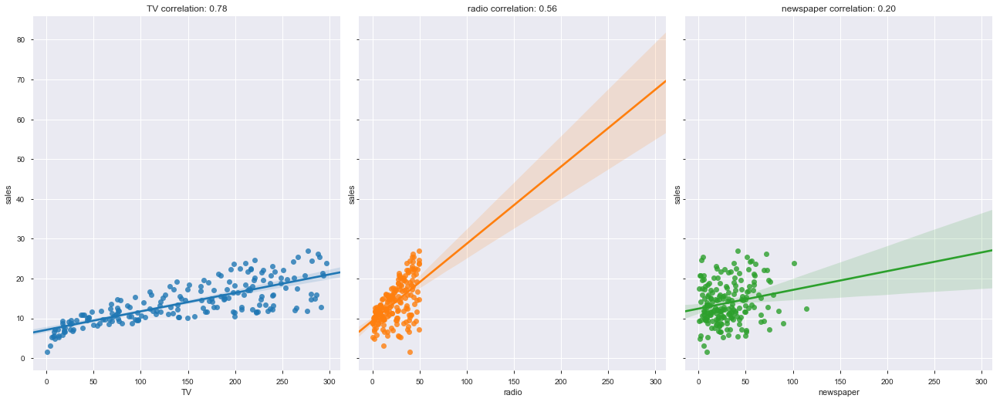

# Miniproyecto - Ciencia de datos

## Descripción

La tarea consiste en analizar y explorar un conjunto de datos sencillo, utilizando las herramientas vistas en clase: `numpy`, `pandas`, `matplotlib`, `seaborn`, `scikit-learn`, etc.

El conjunto de datos está en formato CSV, y se puede descargar [aquí](https://storage.googleapis.com/curso-eoi/sales.csv).

Cada fila del conjunto de datos describe una campaña de marketing con la cantidad de dinero que una empresa no especificada ha empleado en tres canales diferentes: televisión, radio y prensa, además de una última columna que lista las ventas conseguidas en dicha campaña. Las columnas `TV`, `radio` y `newspaper` indican la cantidad de dinero invertida en miles de euros, mientras que la columna `sales` indica miles de unidades vendidas.

## Paso 1

* Limpiar el conjunto de datos de aquellas filas en las que falten datos o haya valores extraños o fuera de rango (recordemos [`pandas.DataFrame.describe()`](https://pandas.pydata.org/pandas-docs/stable/reference/api/pandas.DataFrame.describe.html))
* Crear tres scatter plots (o uno solo con tres subplots) con los ejes debidamente etiquetados, donde el eje X es la cantidad de dinero invertida en ese canal, y el eje Y representa el número de unidades vendidas
* **[OPCIONAL]** Utilizar plotting alternativo, como por ejemplo [`seaborn.regplot()`](https://seaborn.pydata.org/generated/seaborn.regplot.html); este incluye automáticamente una recta de regresión sobre los datos y unos intervalos de confianza ajustables
* **[OPCIONAL]** Investigar acerca del coeficiente de correlación de Pearson (por ejemplo [aquí](https://en.wikipedia.org/wiki/Pearson_correlation_coefficient) y [aquí](https://realpython.com/numpy-scipy-pandas-correlation-python/)), calcularlo y mostrarlo sobre los plots. La funcion [`numpy.corrcoef()`](https://numpy.org/doc/stable/reference/generated/numpy.corrcoef.html) es útil para esto

El resultado debe ser similar a esto:

## Paso 2

Aumentar el dataset con las siguientes dos columnas generadas:

* Cantidad total invertida por venta, es decir, coste total (entre los tres canales) dividido por el número de ventas
* Un valor booleano (`true`/`false`, o `0`/`1`) que indique si la campaña de marketing fue _exitosa_. Una campaña es considerada exitosa si se cumplen **ambas** condiciones siguientes:
    * Cantidad total invertida por venta es menos de 20€
    * Más de 15000 unidades fueron vendidas

Responder a la pregunta: **¿Cuántas campañas fueron exitosas?**

## Paso 3

* Crear un conjunto de entrenamiento seleccionando las filas con `id <= 160`
* Entrenar un clasificador [_Gaussian Naive-Bayes_](https://scikit-learn.org/stable/modules/generated/sklearn.naive_bayes.GaussianNB.html) como vimos en clase para determinar si una campaña será exitosa, dadas las cantidades empleadas en cada canal de marketing
* Calcular la fracción del conjunto de entrenamiento que es clasificado correctamente.
* **[OPCIONAL]** Utilizar clasificadores alternativos, tales como regresión logística ([enlace](https://realpython.com/logistic-regression-python/), [enlace](https://scikit-learn.org/stable/modules/generated/sklearn.linear_model.LogisticRegression.html)) o random forest ([enlace](https://www.datacamp.com/community/tutorials/random-forests-classifier-python), [enlace](https://scikit-learn.org/stable/modules/generated/sklearn.ensemble.RandomForestClassifier.html))

## Paso 4

* Crear un conjunto de prueba seleccionando las filas con `id > 160`
* Evaluar el rendimiento del clasificador de la siguiente manera:
    * ¿Qué porcentaje del conjunto de prueba fue clasificado correctamente (aciertos sobre el total)? Es deseable que este número llegue al menos al 80%
    * ¿Cuál es la proporción de [falsos positivos y falsos negativos](https://en.wikipedia.org/wiki/False_positives_and_false_negatives)?

## Criterios de evaluación

En orden de importancia, se evaluará la entrega acorde a los siguientes puntos:

1. **<ins>Implementación de los puntos obligatorios en los cuatro pasos</ins>**
2. **<ins>Correctitud de los datos obtenidos</ins>**
3. **<ins>Implementación de los puntos opcionales</ins>**
4. **<ins>Organización y limpieza del código</ins>**

## Fecha límite de entrega

La tarea deberá ser entregada, a más tardar, el **miércoles 15 de julio** a las **23:59 WEST**

## Forma de entrega

Se habilitará una tarea en nuestro Google Classroom a tal efecto para poder subir los ficheros finales. El formato de entrega puede ser en Jupyter Notebook (preferible) o en ficheros `.py` directamente y `.png` para los plots.
