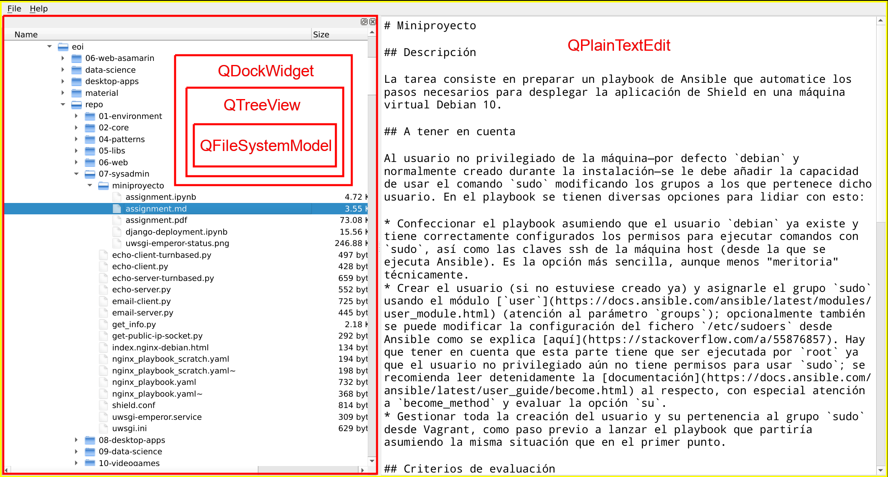

# Miniproyecto

## Descripción

La tarea consiste en extender la aplicación gráfica que trabajamos en clase (`pynotepad`) y añadirle un explorador de ficheros interactivo a la izquierda del editor principal.

## Referencia

La aplicación deberá tener un aspecto similar a este; nótese que las principales clases utilizadas están resaltadas en rojo:

En este caso se ha optado por utilizar las capabilidades organizativas de [`QMainWindow`](https://doc.qt.io/qt-5/qmainwindow.html#qt-main-window-framework) para añadir el [`QTreeView`](https://doc.qt.io/qt-5/qtreeview.html) como un [`QDockWidget`](https://doc.qt.io/qt-5/qdockwidget.html), aunque no es estrictamente necesario utilizar estos mismos componentes; puede hacerse también con un [`QHBoxLayout`](https://doc.qt.io/qt-5/qhboxlayout.html) organizando horizontalmente los widgets.

## Requisitos mínimos

* Hacer doble-click sobre un fichero debe tener el efecto de abrirlo en el editor central. Doble-click sobre un directorio debe expandir o contraer la vista de ese directorio (ese comportamiento ya está implementado por defecto usando `QTreeView` en conjunción con `QFileSystemModel`)

## Mejoras opcionales

* Menú contextual al hacer click derecho en el QTreeView
    * Mostrar algunas opciones extras aquí (cuantas más, mejor); por ejemplo _abrir fichero_, _renombrar_, _borrar_ o _copiar ruta en el portapapeles_. Dichas acciones deben estar realmente implementadas

## Criterios de evaluación

En orden de importancia, se evaluará la entrega acorde a los siguientes puntos:

1. **<ins>Funcionalidad</ins>**: La aplicación debe ejecutarse sin errores y hacer lo que se le supone. Se espera también cierta estabilidad frente a acciones "no-comunes" por parte del usuario, como por ejemplo pulsaciones de teclas inesperadas o redimensionado de la ventana; en general, con aplicaciones de este tipo es una buena práctica guiarse por el [POLA](https://en.wikipedia.org/wiki/Principle_of_least_astonishment)
2. **<ins>Mejoras opcionales</ins>**: Se valorarán todas aquellas mejoras que se implementen más allá de los requisitos mínimos
3. **<ins>Organización de código</ins>**: A medida que se vayan implementando funcionalidades, la organización básica de "todo en un fichero" y "todo objetos globales" es cada vez más problemática. Investigar maneras más avanzadas de gestionar el código; recomiendo revisar el código fuente de algunas aplicaciones de código abierto que usan PyQt, como por ejemplo [Anki](https://github.com/ankitects/anki/tree/master/qt/aqt) o [Calibre](https://github.com/kovidgoyal/calibre/tree/master/src/calibre/gui2)
