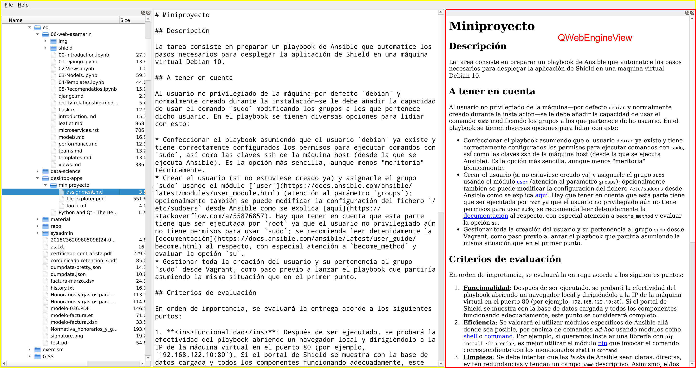

# Miniproyecto

## Descripción

La tarea consiste en extender la aplicación gráfica que trabajamos en clase (`pynotepad`) y añadirle un explorador de ficheros interactivo a la izquierda del editor principal.

## Referencia

La aplicación deberá tener un aspecto similar a este; nótese que las principales clases utilizadas están resaltadas en rojo:

En este caso se ha optado por utilizar las capabilidades organizativas de [`QMainWindow`](https://doc.qt.io/qt-5/qmainwindow.html#qt-main-window-framework) para añadir el [`QTreeView`](https://doc.qt.io/qt-5/qtreeview.html) como un [`QDockWidget`](https://doc.qt.io/qt-5/qdockwidget.html), aunque no es estrictamente necesario utilizar estos mismos componentes; puede hacerse también con un [`QHBoxLayout`](https://doc.qt.io/qt-5/qhboxlayout.html) organizando horizontalmente los widgets.

## Requisitos mínimos

* Hacer doble-click sobre un fichero debe tener el efecto de abrirlo en el editor central. Doble-click sobre un directorio debe expandir o contraer la vista de ese directorio (ese comportamiento ya está implementado por defecto usando `QTreeView` en conjunción con `QFileSystemModel`)

## Mejoras opcionales

* Menú contextual al hacer click derecho en el QTreeView
    * Mostrar algunas opciones extras aquí (cuantas más, mejor); por ejemplo _abrir fichero_, _renombrar_, _borrar_ o _copiar ruta en el portapapeles_. Dichas acciones deben estar realmente implementadas
* Implementar un editor de Markdown
    * La clase a utilizar en este caso es [`QWebEngineView`](https://doc.qt.io/qt-5/qwebengineview.html)
    * El import correcto es `from PyQt5.QtWebEngineWidgets import QWebEngineView`
    * `QtWebEngineWidgets` es un paquete aparte que no viene en la instalación por defecto de PyQt5, por lo que es necesario instalarlo aparte; ver [aqui](https://stackoverflow.com/a/54947671/1911099)
    * Para generar el HTML correspondiente a un Markdown dado, se pueden utilizar varios módulos ya existentes para ello; [ejemplo](https://github.com/trentm/python-markdown2)
    * Hay varias opciones también para gestionar el "refresco" de la vista HTML; la más sencilla es añadir un botón en algún lugar de la interfaz para generar el nuevo HTML y configurar el `QWebEngineView` para mostrarlo. Opciones más realistas pasan por refrescar la vista al guardar el fichero, o al transcurrir un tiempo determinado desde la última pulsación de tecla (2 segundos es un tiempo razonable para ello)
    * Habrá que prestar atención a los posibles errores de conversión Markdown -> HTML que se puedan dar. Si no es posible generar HTML válido, la vista del `QWebEngineView` debería quedarse en blanco, o mostrar algún tipo de mensaje de error

## Criterios de evaluación

En orden de importancia, se evaluará la entrega acorde a los siguientes puntos:

1. **<ins>Funcionalidad</ins>**: La aplicación debe ejecutarse sin errores y hacer lo que se le supone. Se espera también cierta estabilidad frente a acciones "no-comunes" por parte del usuario, como por ejemplo pulsaciones de teclas inesperadas o redimensionado de la ventana; en general, con aplicaciones de este tipo es una buena práctica guiarse por el [POLA](https://en.wikipedia.org/wiki/Principle_of_least_astonishment)
2. **<ins>Mejoras opcionales</ins>**: Se valorarán todas aquellas mejoras que se implementen más allá de los requisitos mínimos
3. **<ins>Organización de código</ins>**: A medida que se vayan implementando funcionalidades, la organización básica de "todo en un fichero" y "todo objetos globales" es cada vez más problemática. Investigar maneras más avanzadas de gestionar el código; recomiendo revisar el código fuente de algunas aplicaciones de código abierto que usan PyQt, como por ejemplo [Anki](https://github.com/ankitects/anki/tree/master/qt/aqt) o [Calibre](https://github.com/kovidgoyal/calibre/tree/master/src/calibre/gui2)

## Fecha límite de entrega

La tarea deberá ser entregada, a más tardar, el **domingo 5 de julio** a las **23:59 WEST**

## Forma de entrega

Se habilitará una tarea en nuestro Google Classroom a tal efecto para poder subir los ficheros finales.
