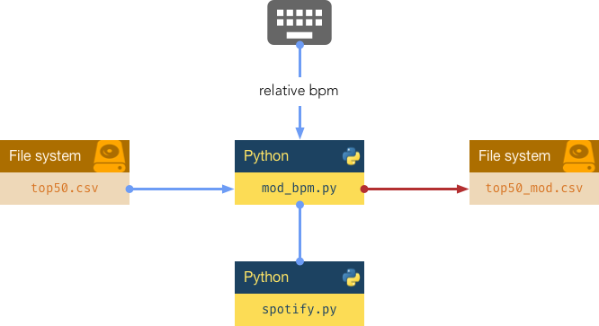

```python
from IPython.display import HTML
from pathlib import Path

css_rules = Path('../custom.css').read_text()
HTML('<style>' + css_rules + '</style>')
```


<style>/* title of columns */
table thead th {
    font-size: 1.2em !important;
    padding-top: 0.2em !important;
    padding-bottom: 0.2em !important;
    text-align: left !important;
}

/* title of rows */
table tbody th {
    font-size: 1.2em !important;
    background: rgba(199, 199, 199, 0.356) !important;
    border: 1px solid black !important;
    text-align: left !important;
}

/* style for each cell */
table td {
    font-size: 1.15em !important;
    border: 1px solid black !important;
    text-align: left !important;
}

/* disable zebra-style */
table tbody tr {
    background: white !important;
}

/* row color on hover */
table tbody tr:hover {
    background: rgba(43, 137, 226, 0.144) !important;
}

/* SLIDES */
.slides table td {
    font-size: 15pt !important;
}

.slides table th {
    font-size: 15pt !important;
}

.slides img {
    margin-left: auto !important;
    margin-right: auto !important;
}

.slides blockquote {
    margin: 0 !important;
    box-shadow: none !important;
    width: 100% !important;
    border-left: 5px solid lightgray !important;
    color: #284d71 !important;
    padding: 0 0 0 10px !important;
    background-color: #f9f9f9 !important;
    font-size: 20px !important;
}

.slides blockquote p {
    margin: 10px 0 10px 0 !important;
}
</style>


# Miniproyecto


El objetivo del miniproyecto es integrar la mayoría de los elementos del lenguaje de programación Python vistos hasta ahora e implementar una **pequeña base de datos** para canciones de *Spotify* utilizando el paradigma de *orientación a objetos*.

## 🎧 Fichero de datos

Vamos a partir de un [fichero de datos extraído de Kaggle](https://www.kaggle.com/leonardopena/top50spotify2019) que contiene las *50 canciones más escuchadas en el mundo en Spotify durante el año 2019*.

He limpiado este fichero para quedarnos únicamente con los datos que nos interesan. Las columnas con las que vamos a trabajar son las siguientes:

- **Col. 0** ➡️ `Track Name`: nombre de la canción (*cadena de texto*).
- **Col. 1** ➡️ `Artist Name`: nombre del artista (*cadena de texto*).
- **Col. 2** ➡️ `Genre`: género de la canción (*cadena de texto*).
- **Col. 3** ➡️ `Beats Per Minute`: tempo de la canción (*valor entero*).
- **Col. 4** ➡️ `Energy`: indica lo "energética" que es la canción (*valor entero*).
- **Col. 5** ➡️ `Danceability`: indica lo "bailable" que es la canción (*valor entero*).
- **Col. 6** ➡️ `Length`: duración de la canción (*valor entero*).

📎 [top50.csv](files/top50.csv)

## ✍🏻 Requisitos del programa

Nuestro programa permitirá modificar la velocidad de las canciones variando sus *bpm* (*beats per minute*) o [pulsaciones por minuto](https://es.wikipedia.org/wiki/Pulsaciones_por_minuto).



Ejemplos de ejecución:

~~~python
> python mod_bpm.py 10   # increase songs in 10bpm
> python mod_bpm.py -25  # decrease songs in 25bpm
~~~

## 🥏 Código a implementar

`spotify.py`

~~~python
class Song:
    def __init__(self, track, artist, genre, bpm, energy, danceability, length):
        # your code here
    
    def __str__(self):
        # your code here
    
    def change_speed(self, relative_bpm):
        # your code here
    
    @staticmethod
    def load_songs(path):
        # your code here
        return songs
    
    @staticmethod
    def save_songs(songs, path):
        # your code here
~~~

`mod_bpm.py`

~~~python
import sys

from spotify import Song


'''Information about headers in datafile
0: track name
1: artist name
2: genre
3: beats per minute
4: energy
5: danceability
6: length'''


input_file = '../files/top50.csv'
output_file = '../files/top50_mod.csv'
relative_bpm = int(sys.argv[1])  # read keyboard input

# load songs (from input_file)

# change speed of all songs

# save songs (to output_file)
~~~

## 🍩 Detalles de implementación

### `__init__`

Constructor de la clase para almacenar parámetros.

### `__str__`

El formato de salida debe ser una línea con los campos separados por comas, tal y como está definido en el fichero de entrada.

### `load_songs`

Leer el fichero de datos, crear un objeto de tipo `Song` por cada línea del fichero y devolver *una lista* con todas las canciones (objetos).

### `save_songs`

El parámetro `songs` será una lista de canciones. Almacenar todas las canciones en el fichero de salida con el mismo formato que el fichero de entrada. Utilizar de forma implícita la llamada al método `__str__` de cada objeto.

### `change_speed`

Actualizar parámetros:

Si aumentamos en $x$ bpms una determinada canción, el resto de parámetros se actualiza así:
- La *energía* aumenta en $2x$
- La *bailavilidad* aumenta en $3x$
- La *longitud* disminuye en $x$

Si disminuimos en $y$ bpms una determinada canción, el resto de parámetros se actualiza así:
- La *energía* disminuye en $2y$
- La *bailavilidad* disminuye en $3y$
- La *longitud* aumenta en $y$

## 🔍 Comprobación de resultados

Para comprobar si tu programa está funcionando bien, te dejo la salida de dos ejecuciones:

- `> python mod_bpm.py 10` ➡️ [top50_mod_plus10.csv](files/top50_mod_plus10.csv)


- `> python mod_bpm.py -5` ➡️ [top50_mod_minus5.csv](files/top50_mod_minus5.csv)

La forma más sencilla es comparar el fichero de salida de tu programa `top50_mod.csv` con el correspondiente de los anteriores. La herramienta `diff` compara dos ficheros y nos dice si son exactamente iguales:

~~~bash
> diff -s top50_mod.csv top50_mod_plus10.csv
Files top50_mod.csv and top50_mod_plus10.csv are identical
~~~

~~~bash
> diff -s top50_mod.csv top50_mod_minus5.csv
Files top50_mod.csv and top50_mod_minus5.csv are identical
~~~

## 📊 Rúbrica de evaluación

Fichero | Item | Valoración
--- | --- | ---
- | Salida correcta | 30%
`mod_bpm.py` | Carga de canciones | 5%
`mod_bpm.py` | Modificación de velocidad | 5%
`mod_bpm.py` | Escritura de canciones | 5%
`spotify.py` | `__init__` | 5%
`spotify.py` | `__str__` | 5%
`spotify.py` | `change_speed` | 10%
`spotify.py` | `load_songs` | 20%
`spotify.py` | `save_songs` | 15%
